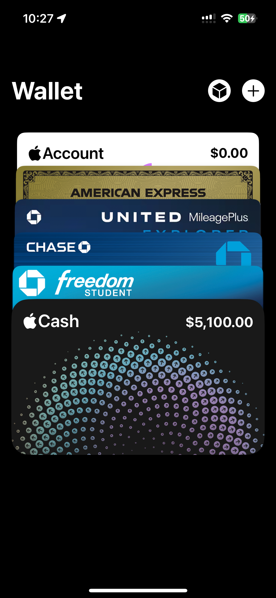
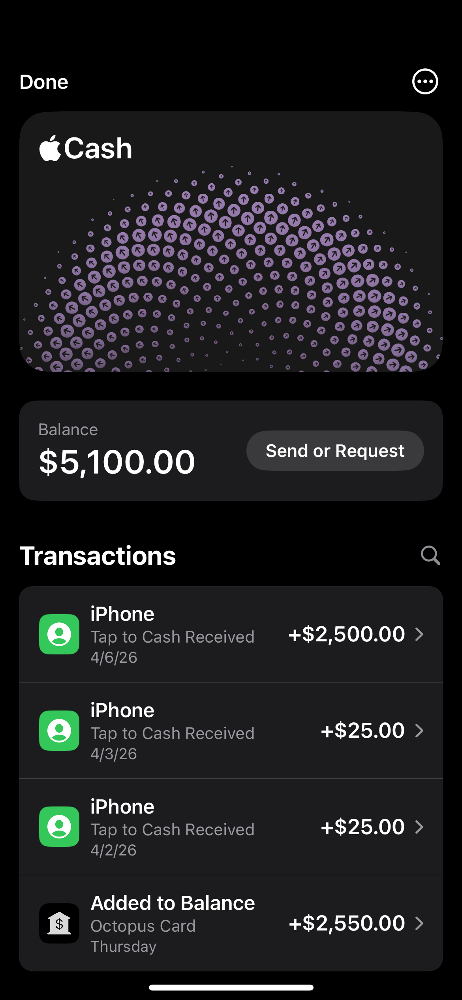
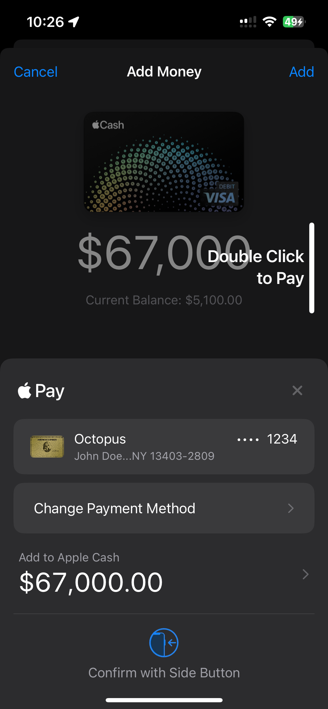
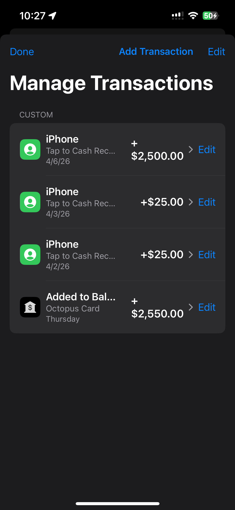
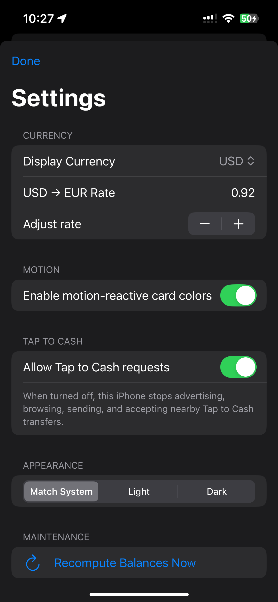

## Apple Wallet Clone

I’m new to programming in Swift, and for the past few months I’ve been working on building a clone of the Apple Wallet app because I couldn’t think of what else to build.

### Features

- Motion support for the Cash card

- Motion support for Apple Account / gc visuals

- Partial add card flow

- Partial Tap to Cash flow

- Add money from other cards via Apple Pay

- Transfer money to a bank

- Hidden transaction editor by long pressing Transactions on the card details screen

- Hidden settings menu by long pressing Wallet on the home screen

Im working on adding new stuff to make it closer to the app, the version thats being distributed is water marked because I’ve seen that people can use these types of apps for fraud and I don't want that happening

I’ve mainly been focused on recreating the look and feel of Apple Wallet as closely as I can while learning Swift and SwiftUI.

I will not open source this project but I am willing to share builds
Im making these apps to improve my skills with iOS development and show my abilities off to potential employers 

  
  
  
  
  

